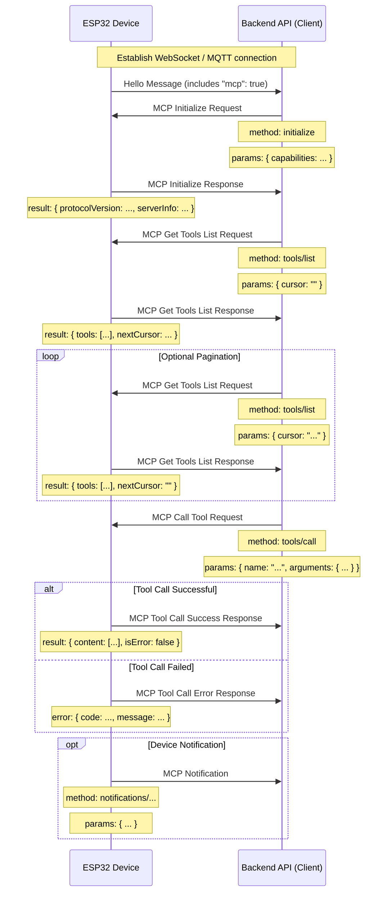

# MCP (Model Context Protocol) Interaction Flow

NOTICE: AI-assisted draft. When implementing your backend service, confirm details against the code!

In this project, the MCP protocol is used for communication between the backend API (MCP client) and the ESP32 device (MCP server) so the backend can discover and call functions (tools) provided by the device.

## Message Format

Per the code (`main/protocols/protocol.cc`, `main/mcp_server.cc`), MCP messages are carried inside the payload of the base transport (WebSocket or MQTT). The inner structure follows the [JSON-RPC 2.0](https://www.jsonrpc.org/specification) spec.

Example envelope:

```json
{
  "session_id": "...",  
  "type": "mcp",        
  "payload": {           
    "jsonrpc": "2.0",
    "method": "...",   
    "params": { ... },  
    "id": ...,          
    "result": { ... },  
    "error": { ... }    
  }
}
```

Within `payload` (JSON-RPC 2.0):

- jsonrpc: fixed string "2.0".
- method: method name (for Request).
- params: structured arguments, typically an object (for Request).
- id: request identifier set by the client; echoed in the response to match request/response.
- result: method result (for success response).
- error: error object (for error response).

## Interaction Flow and Timing

MCP interactions revolve around the backend (client) discovering and invoking device "tools".

1. Connection established and capability announcement

   - Timing: after the device connects to the backend via the base transport.
   - Sender: device.
   - Message: the device sends a base-protocol "hello" message including supported capabilities, such as MCP ("mcp": true).
   - Example (base protocol, not MCP payload):
     ```json
     {
       "type": "hello",
       "version": 3,
       "features": {
         "mcp": true
       },
       "transport": "websocket",
       "audio_params": { "...": "..." },
       "session_id": "..."
     }
     ```

2. Initialize MCP session

   - Timing: after receiving the hello and confirming MCP support; typically the first MCP request.
   - Sender: backend API (client).
   - Method: initialize
   - Request (MCP payload):

     ```json
     {
       "jsonrpc": "2.0",
       "method": "initialize",
       "params": {
         "capabilities": {
           "vision": {
             "url": "...",   
             "token": "..."  
           }
         }
       },
       "id": 1
     }
     ```

   - Device response timing: once the device handles initialize.
   - Response (MCP payload):
     ```json
     {
       "jsonrpc": "2.0",
       "id": 1,
       "result": {
         "protocolVersion": "2024-11-05",
         "capabilities": {
           "tools": {}
         },
         "serverInfo": {
           "name": "...",
           "version": "..."
         }
       }
     }
     ```

3. Discover device tools

   - Timing: when the backend needs the list of current tools and their schemas.
   - Sender: backend API (client).
   - Method: tools/list
   - Request (MCP payload):
     ```json
     {
       "jsonrpc": "2.0",
       "method": "tools/list",
       "params": {
         "cursor": ""
       },
       "id": 2
     }
     ```
   - Device response timing: after building the tool list.
   - Response (MCP payload):
     ```json
     {
       "jsonrpc": "2.0",
       "id": 2,
       "result": {
         "tools": [
           {
             "name": "self.get_device_status",
             "description": "...",
             "inputSchema": { "...": "..." }
           },
           {
             "name": "self.audio_speaker.set_volume",
             "description": "...",
             "inputSchema": { "...": "..." }
           }
         ],
         "nextCursor": "..."
       }
     }
     ```
   - Pagination: if nextCursor is non-empty, call tools/list again with that cursor value.

4. Call a device tool

   - Timing: when the backend needs to execute a device function.
   - Sender: backend API (client).
   - Method: tools/call
   - Request (MCP payload):
     ```json
     {
       "jsonrpc": "2.0",
       "method": "tools/call",
       "params": {
         "name": "self.audio_speaker.set_volume",
         "arguments": {
           "volume": 50
         }
       },
       "id": 3
     }
     ```
   - Device success response timing: after executing the tool.
   - Success response:
     ```json
     {
       "jsonrpc": "2.0",
       "id": 3,
       "result": {
         "content": [
           { "type": "text", "text": "true" }
         ],
         "isError": false
       }
     }
     ```
   - Error response:
     ```json
     {
       "jsonrpc": "2.0",
       "id": 3,
       "error": {
         "code": -32601,
         "message": "Unknown tool: self.non_existent_tool"
       }
     }
     ```

5. Device-initiated messages (Notifications)

   - Timing: when the device needs to inform the backend of events (e.g., state changes). The existence of `Application::SendMcpMessage` suggests device-originated MCP messages are possible.
   - Sender: device (server).
   - Method: may be prefixed with notifications/ or other custom names.
   - Message (JSON-RPC Notification, no id):
     ```json
     {
       "jsonrpc": "2.0",
       "method": "notifications/state_changed",
       "params": {
         "newState": "idle",
         "oldState": "connecting"
       }
     }
     ```
   - Backend handling: process the notification; no reply.

## Sequence Diagram

A simplified sequence diagram of the MCP flow:



This document outlines the main MCP interactions in this project. For concrete parameter details and tool implementations, see `main/mcp_server.cc` (e.g., `McpServer::AddCommonTools`) and each tool's code.
