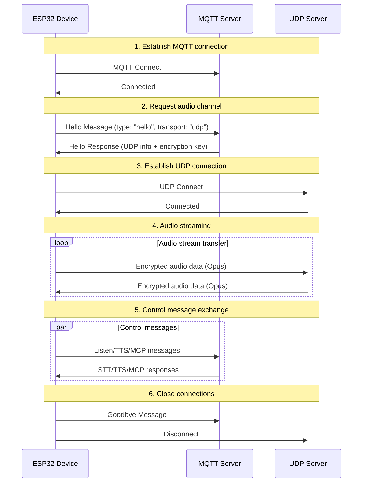
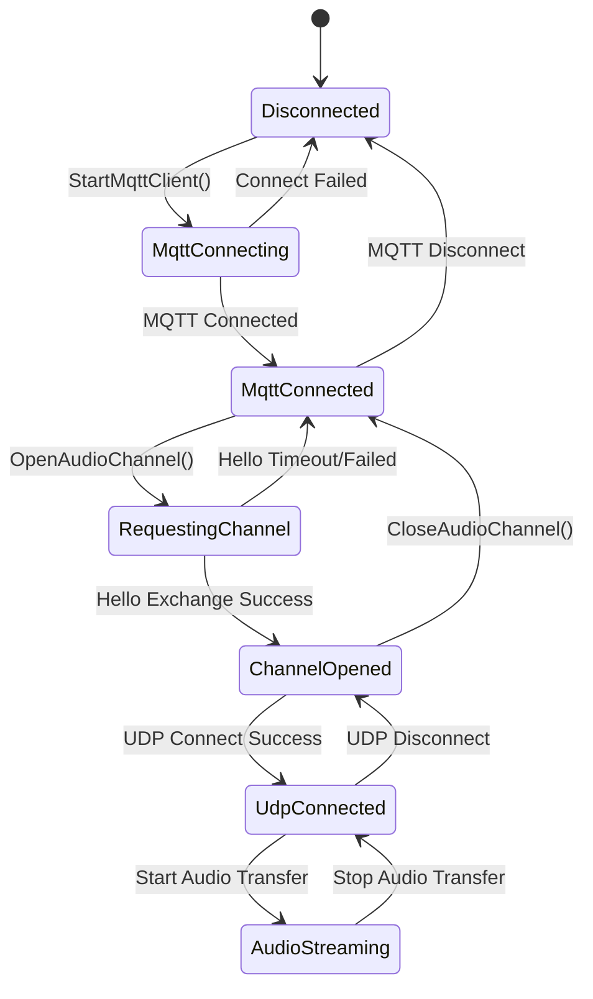

# MQTT + UDP Hybrid Communication Protocol

This document summarizes the MQTT + UDP hybrid communication protocol based on the current implementation. It describes how the device and server interact: MQTT carries control/status/JSON messages, while UDP carries real-time audio data.

---

## 1. Protocol Overview

This protocol uses a hybrid transport model:
- MQTT: control messages, state sync, JSON exchange
- UDP: real-time audio transport, with encryption

### 1.1 Key Characteristics

- Dual-channel design: separates control and data to ensure real-time performance
- Encrypted transport: audio over UDP is encrypted with AES-CTR
- Sequence protection: prevents replay and excessive reordering
- Auto-reconnect: reconnects when MQTT disconnects

---

## 2. End-to-end Flow Overview



---

## 3. MQTT Control Channel

### 3.1 Connection Establishment

The device connects to an MQTT server with:
- Endpoint: broker host and port
- Client ID: device unique identifier
- Username/Password: credentials
- Keep Alive: heartbeat interval (default 240s)

### 3.2 Hello Message Exchange

#### 3.2.1 Device sends Hello

```json
{
  "type": "hello",
  "version": 3,
  "transport": "udp",
  "features": {
    "mcp": true
  },
  "audio_params": {
    "format": "opus",
    "sample_rate": 16000,
    "channels": 1,
    "frame_duration": 60
  }
}
```

#### 3.2.2 Server responds to Hello

```json
{
  "type": "hello",
  "transport": "udp",
  "session_id": "xxx",
  "audio_params": {
    "format": "opus",
    "sample_rate": 24000,
    "channels": 1,
    "frame_duration": 60
  },
  "udp": {
    "server": "192.168.1.100",
    "port": 8888,
    "key": "0123456789ABCDEF0123456789ABCDEF",
    "nonce": "0123456789ABCDEF0123456789ABCDEF"
  }
}
```

Field notes:
- udp.server: UDP server address
- udp.port: UDP server port
- udp.key: AES encryption key (hex string)
- udp.nonce: AES nonce (hex string)

### 3.3 JSON Message Types

#### 3.3.1 Device → Server

1. Listen
   ```json
   {
     "session_id": "xxx",
     "type": "listen",
     "state": "start",
     "mode": "manual"
   }
   ```

2. Abort
   ```json
   {
     "session_id": "xxx",
     "type": "abort",
     "reason": "wake_word_detected"
   }
   ```

3. MCP
   ```json
   {
     "session_id": "xxx",
     "type": "mcp",
     "payload": {
       "jsonrpc": "2.0",
       "id": 1,
       "result": {"...": "..."}
     }
   }
   ```

4. Goodbye
   ```json
   {
     "session_id": "xxx",
     "type": "goodbye"
   }
   ```

#### 3.3.2 Server → Device

Supported types are aligned with the WebSocket protocol, including:
- STT: speech recognition results
- TTS: text-to-speech control
- LLM: expressive/emotion control
- MCP: IoT/agent control
- System: system control
- Custom: custom message (optional)

---

## 4. UDP Audio Channel

### 4.1 Connection Establishment

After receiving the MQTT Hello response, the device opens the UDP audio channel:
1. Parse UDP server address and port
2. Parse encryption key and nonce
3. Initialize AES-CTR context
4. Create/Connect UDP socket

### 4.2 Audio Data Format

#### 4.2.1 Encrypted packet layout

```
|type 1byte|flags 1byte|payload_len 2bytes|ssrc 4bytes|timestamp 4bytes|sequence 4bytes|
|payload payload_len bytes|
```

Field notes:
- type: packet type, fixed 0x01
- flags: bit flags, currently unused
- payload_len: payload length (network byte order)
- ssrc: synchronization source ID
- timestamp: timestamp (network byte order)
- sequence: sequence number (network byte order)
- payload: encrypted Opus audio data

#### 4.2.2 Encryption

AES-CTR is used:
- Key: 128-bit, provided by server
- Nonce: 128-bit, provided by server
- Counter: constructed with timestamp and sequence

### 4.3 Sequence Management

- Sender: local_sequence_ increases monotonically
- Receiver: remote_sequence_ validates continuity
- Anti-replay: drop packets with sequence below expected
- Tolerance: allow minor jumps; log a warning

### 4.4 Error Handling

1. Decryption failed: log error, drop packet
2. Abnormal sequence: log warning, still process
3. Malformed packet: log error, drop packet

---

## 5. State Management

### 5.1 Connection States



### 5.2 Availability Check

The device checks whether the audio channel is available via:
```cpp
bool IsAudioChannelOpened() const {
    return udp_ != nullptr && !error_occurred_ && !IsTimeout();
}
```

---

## 6. Configuration Parameters

### 6.1 MQTT Settings

Read from settings:
- endpoint: MQTT server address
- client_id: client identifier
- username: username
- password: password
- keepalive: heartbeat interval (default 240s)
- publish_topic: publish topic

### 6.2 Audio Parameters

- Format: Opus
- Sample rate: 16000 Hz (device) / 24000 Hz (server)
- Channels: 1 (mono)
- Frame duration: 60 ms

---

## 7. Errors and Reconnect

### 7.1 MQTT Reconnect

- Auto-retry on connection failure
- Optional error reporting
- Run cleanup on disconnect

### 7.2 UDP Connection Management

- Do not auto-retry on UDP connect failure
- Re-negotiate via MQTT when needed
- Support connection state query

### 7.3 Timeout Handling

The base class Protocol provides timeout detection:
- Default timeout: 120 seconds
- Based on time since last receive
- Mark as unavailable on timeout

---

## 8. Security Considerations

### 8.1 Transport Encryption

- MQTT: TLS/SSL (port 8883)
- UDP: AES-CTR for audio payload

### 8.2 Authentication

- MQTT: username/password
- UDP: key distribution via MQTT hello

### 8.3 Anti-replay

- Monotonic sequence numbers
- Drop expired packets
- Timestamp validation

---

## 9. Performance Optimization

### 9.1 Concurrency

Use a mutex to protect the UDP channel:
```cpp
std::lock_guard<std::mutex> lock(channel_mutex_);
```

### 9.2 Memory Management

- Dynamic creation/destruction of network objects
- Smart pointers for audio packets
- Release crypto contexts timely

### 9.3 Network Optimization

- UDP socket reuse
- Packet size tuning
- Sequence continuity checks

---

## 10. Comparison with WebSocket

| Feature | MQTT + UDP | WebSocket |
|--------|------------|-----------|
| Control channel | MQTT | WebSocket |
| Audio channel | UDP (encrypted) | WebSocket (binary) |
| Real-time performance | High (UDP) | Medium |
| Reliability | Medium | High |
| Complexity | Higher | Lower |
| Encryption | AES-CTR | TLS |
| Firewall friendliness | Lower | Higher |

---

## 11. Deployment Guidance

### 11.1 Network Environment

- Ensure UDP ports are reachable
- Configure firewall rules
- Consider NAT traversal

### 11.2 Server Setup

- MQTT broker configuration
- UDP server deployment
- Key management system

### 11.3 Monitoring Metrics

- Connection success rate
- Audio transport latency
- Packet loss rate
- Decryption failure rate

---

## 12. Summary

The MQTT + UDP hybrid protocol achieves efficient voice communication via:

- Split architecture: separate control and data planes
- Encryption: AES-CTR to secure audio payloads
- Sequencing: prevent replay and excessive reordering
- Recovery: auto-reconnect support after disconnections
- Performance: UDP ensures timely audio delivery

This protocol suits voice-interaction scenarios requiring low latency, with trade-offs between network complexity and transport performance.
