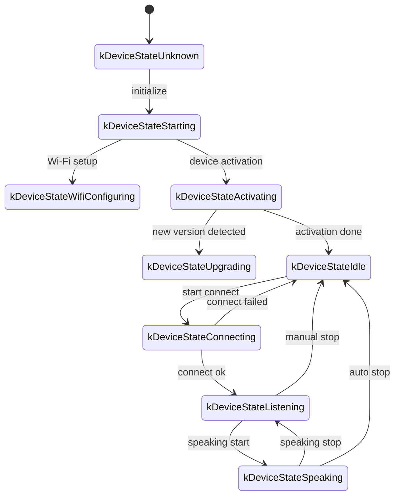
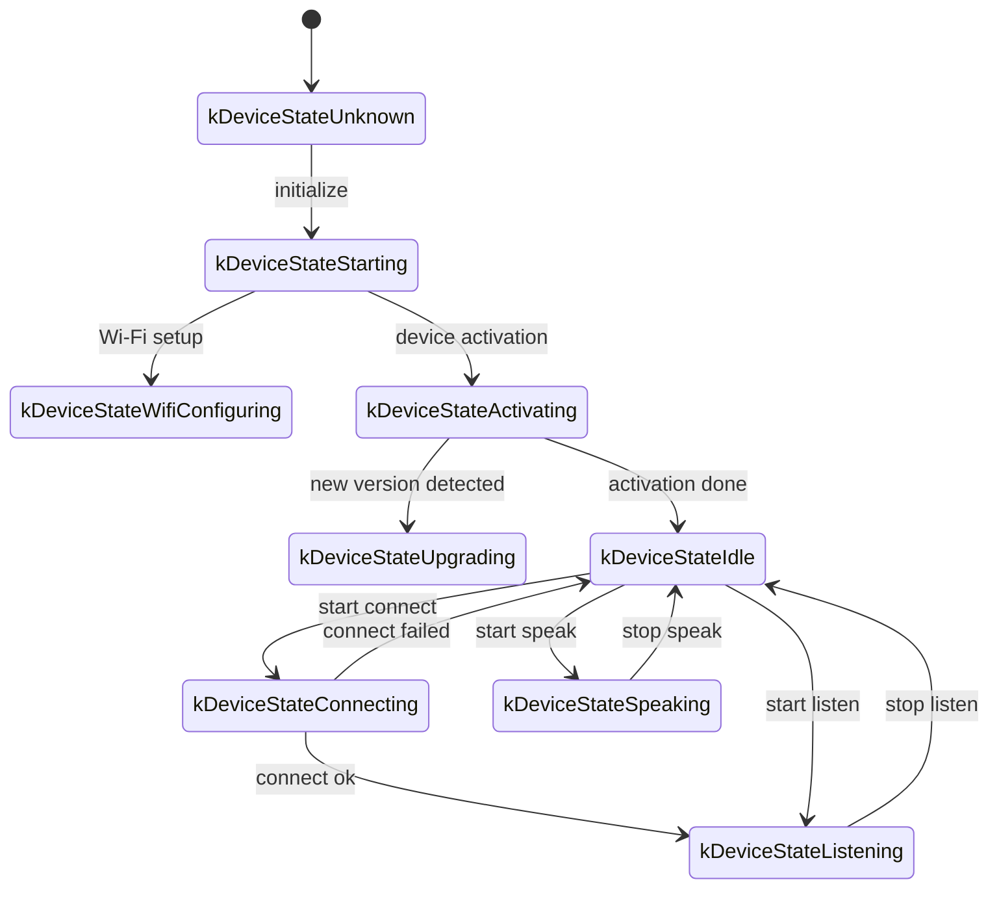

This document describes the WebSocket communication protocol inferred from the implementation in this repository. It explains how the device and server interact over WebSocket.

Note: The content is based on code analysis. In production, validate details against your actual server implementation and extend as needed.

---

## 1. High‑level flow

1. Device initialization
   - On boot, initialize `Application`:
     - Initialize audio codec, display, LEDs, etc.
     - Connect to the network
     - Create and initialize the WebSocket protocol instance implementing `Protocol` (`WebsocketProtocol`)
   - Enter the main loop waiting for events (audio in, audio out, scheduled tasks, etc.).

2. Open the WebSocket connection
   - When a voice session should start (e.g., wake word detected or a button press), call `OpenAudioChannel()`:
     - Get WebSocket URL from configuration
     - Set request headers (`Authorization`, `Protocol-Version`, `Device-Id`, `Client-Id`)
     - Call `Connect()` to establish the WebSocket connection

3. Device sends a "hello" message
   - After connection is established, the device sends a JSON message similar to:
   ```json
   {
     "type": "hello",
     "version": 1,
     "features": {
       "mcp": true
     },
     "transport": "websocket",
     "audio_params": {
       "format": "opus",
       "sample_rate": 16000,
       "channels": 1,
       "frame_duration": 60
     }
   }
   ```
   - The `features` field is optional and generated at build time based on compile options. Example: `"mcp": true` indicates MCP is supported.
   - `frame_duration` corresponds to `OPUS_FRAME_DURATION_MS` (e.g., 60ms).

4. Server replies with "hello"
   - The device waits for a JSON message with `"type": "hello"` and validates `"transport": "websocket"`.
   - The server may optionally include a `session_id`, which the device will store.
   - Example:
   ```json
   {
     "type": "hello",
     "transport": "websocket",
     "session_id": "xxx",
     "audio_params": {
       "format": "opus",
       "sample_rate": 24000,
       "channels": 1,
       "frame_duration": 60
     }
   }
   ```
   - If it matches, the audio channel is marked open and ready.
   - If the correct reply is not received within the timeout (10s by default), the connection is treated as failed and a network error callback is triggered.

5. Subsequent messages
   - Two main payload types travel between device and server:
     1. Binary audio frames (Opus)
     2. Text JSON messages (chat state, TTS/STT events, MCP messages, etc.)

   - Receive callbacks in code:
     - `OnData(...)`:
       - When `binary` is `true`, treat data as audio frames; the device decodes Opus.
       - When `binary` is `false`, treat data as JSON text; the device parses with cJSON and applies business logic (chat, TTS, MCP, etc.).

   - If the server disconnects or network drops, `OnDisconnected()` is invoked:
     - The device calls `on_audio_channel_closed_()` and returns to idle.

6. Close the WebSocket
   - When the session should end, the device calls `CloseAudioChannel()` and returns to idle.
   - If the server closes first, the same callbacks apply.

---

## 2. Common request headers

When establishing the WebSocket connection, the following headers are set:

- `Authorization`: access token, for example `"Bearer <token>"`
- `Protocol-Version`: protocol version; should match the `version` in the hello message
- `Device-Id`: device MAC address
- `Client-Id`: software‑generated UUID (reset when NVS is erased or firmware is fully reflashed)

These are sent during the WebSocket handshake for server‑side auth/validation as needed.

---

## 3. Binary protocol versions

The device supports multiple binary protocol versions configured via the `version` field.

### 3.1 Version 1 (default)
Send raw Opus frames without extra metadata. WebSocket frames distinguish text vs. binary.

### 3.2 Version 2
Structure `BinaryProtocol2`:
```c
struct BinaryProtocol2 {
    uint16_t version;        // protocol version
    uint16_t type;           // message type (0: OPUS, 1: JSON)
    uint32_t reserved;       // reserved
    uint32_t timestamp;      // timestamp in ms (for server‑side AEC)
    uint32_t payload_size;   // bytes
    uint8_t payload[];       // payload
} __attribute__((packed));
```

### 3.3 Version 3
Structure `BinaryProtocol3`:
```c
struct BinaryProtocol3 {
    uint8_t type;            // message type
    uint8_t reserved;        // reserved
    uint16_t payload_size;   // bytes
    uint8_t payload[];       // payload
} __attribute__((packed));
```

---

## 4. JSON message schema

WebSocket text frames carry JSON. Below are common `type` values and their behavior. Additional fields may appear for specific implementations.

### 4.1 Device → Server

1) Hello
   - Sent by device after connection to report basic parameters.
   - Example:
   ```json
   {
     "type": "hello",
     "version": 1,
     "features": { "mcp": true },
     "transport": "websocket",
     "audio_params": {
       "format": "opus",
       "sample_rate": 16000,
       "channels": 1,
       "frame_duration": 60
     }
   }
   ```

2) Listen
   - Start/stop microphone streaming.
   - Common fields:
     - `"session_id"`: session identifier
     - `"type": "listen"`
     - `"state"`: `"start"`, `"stop"`, `"detect"` (wake word triggered)
     - `"mode"`: `"auto"`, `"manual"`, or `"realtime"`
   - Example (start):
   ```json
   {
     "session_id": "xxx",
     "type": "listen",
     "state": "start",
     "mode": "manual"
   }
   ```

3) Abort
   - Abort current speaking (TTS) or the audio channel.
   - Example:
   ```json
   { "session_id": "xxx", "type": "abort", "reason": "wake_word_detected" }
   ```

4) Wake word detected
   - Notify server that a wake word was detected.
   - Opus audio of the wake segment may be sent beforehand for voiceprint checks.
   - Example:
   ```json
   {
     "session_id": "xxx",
     "type": "listen",
     "state": "detect",
     "text": "你好小明"
   }
   ```

5) MCP
   - The recommended protocol for IoT control. Capability discovery and tool calls are sent as `type: "mcp"` with a JSON‑RPC 2.0 payload (see [MCP protocol](./mcp-protocol.md)).
   - Example (device → server result):
   ```json
   {
     "session_id": "xxx",
     "type": "mcp",
     "payload": {
       "jsonrpc": "2.0",
       "id": 1,
       "result": {
         "content": [ { "type": "text", "text": "true" } ],
         "isError": false
       }
     }
   }
   ```

---

### 4.2 Server → Device

1) Hello
   - Server handshake confirmation.
   - Must include `"type": "hello"` and `"transport": "websocket"`.
   - May include `audio_params` (server expectations or aligned config).
   - May include `session_id`, which device stores.

2) STT
   - Example: `{ "session_id": "xxx", "type": "stt", "text": "..." }`
   - Indicates recognized speech text from the user.

3) LLM
   - Example: `{ "session_id": "xxx", "type": "llm", "emotion": "happy", "text": "😀" }`
   - Instruct device to update UI/emotion.

4) TTS
   - `{ "session_id": "xxx", "type": "tts", "state": "start" }`: server will send TTS audio; device enters speaking state.
   - `{ "session_id": "xxx", "type": "tts", "state": "stop" }`: TTS finished.
   - `{ "session_id": "xxx", "type": "tts", "state": "sentence_start", "text": "..." }`: display the text being spoken.

5) MCP
   - Server issues IoT control via `type: "mcp"` with JSON‑RPC payload.
   - Example (server → device tools/call):
   ```json
   {
     "session_id": "xxx",
     "type": "mcp",
     "payload": {
       "jsonrpc": "2.0",
       "method": "tools/call",
       "params": {
         "name": "self.light.set_rgb",
         "arguments": { "r": 255, "g": 0, "b": 0 }
       },
       "id": 1
     }
   }
   ```

6) System
   - System control commands, often for remote maintenance.
   - Example:
   ```json
   { "session_id": "xxx", "type": "system", "command": "reboot" }
   ```
   - Supported commands:
     - `"reboot"`: reboot the device

7) Custom (optional)
   - Custom messages when `CONFIG_RECEIVE_CUSTOM_MESSAGE` is enabled.
   - Example:
   ```json
   {
     "session_id": "xxx",
     "type": "custom",
     "payload": { "message": "custom content" }
   }
   ```

8) Audio data: binary frames
   - When the server sends binary Opus frames, the device decodes and plays them.
   - If the device is currently in listening/recording state, incoming audio may be ignored or flushed to avoid conflicts.

---

## 5. Audio encode/decode

1) Device uploads recorded audio
   - Microphone input (after AEC/NS/AGC if enabled) is encoded with Opus and sent as binary frames.
   - Depending on protocol version, it may be raw Opus (v1) or binary protocol with metadata (v2/v3).

2) Device plays received audio
   - Incoming binary frames are treated as Opus.
   - The device decodes and outputs audio.
   - If the server uses a different sample rate, resampling may occur after decoding.

---

## 6. Common state transitions

1) Idle → Connecting
   - User trigger/wake → `OpenAudioChannel()` → WebSocket connect → send `{ "type": "hello" }`.

2) Connecting → Listening
   - After connection, calling `SendStartListening(...)` enters recording state and streams mic audio.

3) Listening → Speaking
   - On `{ "type": "tts", "state": "start" }`, stop recording and play received audio.

4) Speaking → Idle
   - On `{ "type": "tts", "state": "stop" }`, playback ends. If not auto‑listening, return to Idle; otherwise re‑enter Listening.

5) Listening/Speaking → Idle (abort/error)
   - `SendAbortSpeaking(...)` or `CloseAudioChannel()` → end session → close WebSocket → back to Idle.

### Auto mode (Mermaid)



### Manual mode (Mermaid)



---

## 7. Error handling

1) Connection failure
   - If `Connect(url)` fails or waiting for server hello times out, `on_network_error_()` is triggered. The device may display "Unable to connect to service" or similar.

2) Server disconnects
   - On abnormal close, `OnDisconnected()` is called:
     - The device invokes `on_audio_channel_closed_()`
     - Returns to Idle or retry logic

---

## 8. Additional notes

1) Authentication
   - Use `Authorization: Bearer <token>`; the server should verify validity.
   - If the token is invalid/expired, the server can reject or later disconnect.

2) Session control
   - Some messages include `session_id` to isolate concurrent dialogs; the server can route accordingly.

3) Audio payloads
   - Default Opus with `sample_rate = 16000`, mono. Frame duration is `OPUS_FRAME_DURATION_MS` (typically 60ms). For better music playback, the server may send 24000 sample‑rate audio.

4) Protocol version
   - Configure binary protocol version via `version` (1/2/3).
   - v1: raw Opus frames
   - v2: binary protocol with timestamp (for server‑side AEC)
   - v3: simplified binary protocol

5) MCP for IoT control
   - Prefer MCP (`type: "mcp"`) for capability discovery, state sync, and control; the legacy `type: "iot"` is deprecated.
   - MCP can run over WebSocket, MQTT, etc. for extensibility and standardization.
   - See [MCP protocol](./mcp-protocol.md) and [MCP usage](./mcp-usage.md).

6) Invalid JSON
   - When required fields are missing (e.g., `{"type": ...}`), the device logs an error and ignores the message.

---

## 9. Message examples

1) Device → Server (handshake)
```json
{
  "type": "hello",
  "version": 1,
  "features": { "mcp": true },
  "transport": "websocket",
  "audio_params": { "format": "opus", "sample_rate": 16000, "channels": 1, "frame_duration": 60 }
}
```

2) Server → Device (hello reply)
```json
{ "type": "hello", "transport": "websocket", "session_id": "xxx", "audio_params": { "format": "opus", "sample_rate": 16000 } }
```

3) Device → Server (start listening)
```json
{ "session_id": "xxx", "type": "listen", "state": "start", "mode": "auto" }
```
The device starts sending binary Opus frames.

4) Server → Device (ASR result)
```json
{ "session_id": "xxx", "type": "stt", "text": "user speech" }
```

5) Server → Device (TTS start)
```json
{ "session_id": "xxx", "type": "tts", "state": "start" }
```
Then the server streams binary audio to play.

6) Server → Device (TTS stop)
```json
{ "session_id": "xxx", "type": "tts", "state": "stop" }
```
The device stops playback and returns to Idle unless otherwise instructed.

---

## 10. Summary

Over WebSocket the device exchanges JSON text frames and binary Opus frames to implement mic streaming, TTS playback, ASR, state management, and MCP control. Key characteristics:

- Handshake: send `"type":"hello"` and wait for the server response.
- Audio channel: bidirectional Opus frames; multiple binary protocol versions are supported.
- JSON messages: keyed by `type` for TTS, STT, MCP, WakeWord, System, Custom, etc.
- Extensibility: add fields as needed, and use headers for additional auth.

Server and device should agree on message fields, ordering, and error handling for smooth interoperability.
